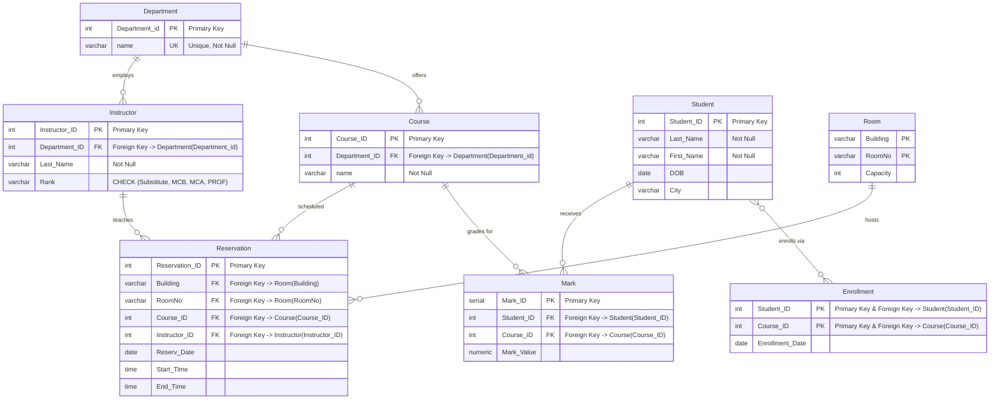

# University Database Management System - Technical Documentation

## Project Overview

This project implements a comprehensive **Educational Institution Management System** using PostgreSQL. The system is designed to manage various aspects of an academic environment, including students, instructors, courses, departments, classrooms, and course reservations. The database architecture follows relational database best practices with proper normalization, referential integrity, and constraint enforcement.

### Purpose and Scope

The primary objective of this system is to provide a robust database solution for managing:
- Student enrollment and academic records
- Instructor assignments and departmental organization
- Course offerings and scheduling
- Room reservations and resource allocation
- Academic performance tracking through marks

This documentation provides a detailed analysis of the database schema, data population, querying capabilities, custom functions, transaction management, and automated triggers.

All this is  to make sure we have a better understanding specially in the technical part for the University Database Management System.

---

## Table of Contents

1. [Database Schema and Structure](#database-schema-and-structure)
2. [Data Population Strategy](#data-population-strategy)
3. [Query Operations and Analysis](#query-operations-and-analysis)
4. [Custom SQL Functions](#custom-sql-functions)
5. [Transaction Management](#transaction-management)
6. [Trigger Implementation](#trigger-implementation)
7. [Technical Considerations](#technical-considerations)

---

## Database Schema and Structure

The database consists of **eight interconnected tables** that model the educational institution's data requirements. The schema demonstrates proper relational design with clear entity separation, foreign key relationships, and data integrity constraints.

### Entity-Relationship Overview


### Table Definitions

#### 1. Department Table

Stores information about academic departments within the institution.

```sql
CREATE TABLE Department (
    Department_id INTEGER,
    name VARCHAR(25) NOT NULL,
    CONSTRAINT UN_Department_Name UNIQUE (name),
    CONSTRAINT PK_Department PRIMARY KEY (Department_id)
);
```

**Attributes:**
- `Department_id` (INTEGER): Primary key uniquely identifying each department
- `name` (VARCHAR(25)): Department name with uniqueness constraint

**Constraints:**
- Primary key on `Department_id`
- Unique constraint on `name` to prevent duplicate department names

**Business Logic:** Each department must have a unique identifier and name. The NOT NULL constraint ensures no department exists without a name.

---

#### 2. Student Table

Manages student information including personal details and contact information.

```sql
CREATE TABLE Student (
    Student_ID INTEGER,
    Last_Name VARCHAR(25) NOT NULL,
    First_Name VARCHAR(25) NOT NULL,
    DOB DATE NOT NULL,
    Address VARCHAR(50),
    City VARCHAR(25),
    Zip_Code VARCHAR(9),
    Phone VARCHAR(10),
    Fax VARCHAR(10),
    Email VARCHAR(100),
    CONSTRAINT PK_Student PRIMARY KEY (Student_ID)
);
```

**Attributes:**
- `Student_ID` (INTEGER): Primary key
- `Last_Name`, `First_Name` (VARCHAR(25)): Required name fields
- `DOB` (DATE): Date of birth (required)
- `Address`, `City`, `Zip_Code`: Optional location information
- `Phone`, `Fax`, `Email`: Optional contact details

**Business Logic:** Students must have basic identifying information (ID, name, DOB), while contact and address details are optional, allowing flexibility for incomplete records.


---

#### 3. Course Table

Defines courses offered by different departments.

```sql
CREATE TABLE Course (
    Course_ID INT4 NOT NULL,
    Department_ID INT4 NOT NULL,
    name VARCHAR(60) NOT NULL,
    Description VARCHAR(1000),
    CONSTRAINT PK_Course PRIMARY KEY (Course_ID, Department_ID),
    CONSTRAINT FK_Course_Department
        FOREIGN KEY (Department_ID)
        REFERENCES Department (Department_id)
        ON UPDATE RESTRICT
        ON DELETE RESTRICT
);
```

**Attributes:**
- `Course_ID`, `Department_ID`: Composite primary key
- `name` (VARCHAR(60)): Course title (required)
- `Description` (VARCHAR(1000)): Optional detailed course information

**Relationships:**
- **Many-to-One** with Department: Each course belongs to exactly one department
- Foreign key constraint with RESTRICT policy prevents deletion/update of departments with associated courses

**Design Decision:** The composite primary key (Course_ID, Department_ID) allows the same course number to exist in different departments while maintaining uniqueness within each department.

---

#### 4. Instructor Table

Stores instructor information with their departmental affiliation and academic rank.

```sql
CREATE TABLE Instructor (
    Instructor_ID INTEGER,
    Department_ID INTEGER NOT NULL,
    Last_Name VARCHAR(25) NOT NULL,
    First_Name VARCHAR(25) NOT NULL,
    Rank VARCHAR(25),
    Phone VARCHAR(10),
    Fax VARCHAR(10),
    Email VARCHAR(100),
    CONSTRAINT CK_Instructor_Rank
        CHECK (Rank IN ('Substitute', 'MCB', 'MCA', 'PROF')),
    CONSTRAINT PK_Instructor PRIMARY KEY (Instructor_ID),
    CONSTRAINT FK_Instructor_Department
        FOREIGN KEY (Department_ID)
        REFERENCES Department (Department_id)
        ON UPDATE RESTRICT
        ON DELETE RESTRICT
);
```

**Attributes:**
- `Instructor_ID` (INTEGER): Primary key
- `Department_ID` (INTEGER): Required foreign key to Department
- `Last_Name`, `First_Name`: Required name fields
- `Rank`: Academic rank with CHECK constraint
- Contact information (Phone, Fax, Email): Optional

**Business Rules:**
- **Rank Constraint:** Only allows four specific values: 'Substitute', 'MCB', 'MCA', 'PROF'
- Every instructor must be assigned to a department
- Referential integrity prevents orphaned instructor records


**Rank Constraint Values:**


---

#### 5. Room Table

Manages physical classroom and lecture hall information.

```sql
CREATE TABLE Room (
    Building VARCHAR(1),
    RoomNo VARCHAR(10),
    Capacity INTEGER CHECK (Capacity > 1),
    CONSTRAINT PK_Room PRIMARY KEY (Building, RoomNo)
);
```

**Attributes:**
- `Building`, `RoomNo`: Composite primary key
- `Capacity` (INTEGER): Number of seats with constraint ensuring at least 2

**Design Rationale:** 
- The composite key allows room numbers to be reused across different buildings
- The capacity constraint ensures rooms are suitable for teaching (minimum 2 people)

---

#### 6. Reservation Table

The central table managing room bookings for courses, linking instructors, rooms, and courses.

```sql
CREATE TABLE Reservation (
    Reservation_ID INTEGER,
    Building VARCHAR(1) NOT NULL,
    RoomNo VARCHAR(10) NOT NULL,
    Course_ID INTEGER NOT NULL,
    Department_ID INTEGER NOT NULL,
    Instructor_ID INTEGER NOT NULL,
    Reserv_Date DATE NOT NULL DEFAULT CURRENT_DATE,
    Start_Time TIME NOT NULL DEFAULT CURRENT_TIME,
    End_Time TIME NOT NULL DEFAULT '23:00:00',
    Hours_Number INTEGER NOT NULL,
    
    CONSTRAINT PK_Reservation PRIMARY KEY (Reservation_ID),
    CONSTRAINT FK_Reservation_Room
        FOREIGN KEY (Building, RoomNo)
        REFERENCES Room (Building, RoomNo)
        ON UPDATE RESTRICT ON DELETE RESTRICT,
    CONSTRAINT FK_Reservation_Course
        FOREIGN KEY (Course_ID, Department_ID)
        REFERENCES Course (Course_ID, Department_ID)
        ON UPDATE RESTRICT ON DELETE RESTRICT,
    CONSTRAINT FK_Reservation_Instructor
        FOREIGN KEY (Instructor_ID)
        REFERENCES Instructor (Instructor_ID)
        ON UPDATE RESTRICT ON DELETE RESTRICT,
    CONSTRAINT CK_Reservation_Hours
        CHECK (Hours_Number >= 1),
    CONSTRAINT CK_Reservation_StartEndTime
        CHECK (Start_Time < End_Time)
);
```

**Attributes:**
- `Reservation_ID`: Primary key
- `Building`, `RoomNo`: Foreign key to Room (composite)
- `Course_ID`, `Department_ID`: Foreign key to Course (composite)
- `Instructor_ID`: Foreign key to Instructor
- `Reserv_Date`: Reservation date with default to current date
- `Start_Time`, `End_Time`: Time boundaries with validation
- `Hours_Number`: Duration in hours

**Complex Relationships:**
This table acts as a junction with three foreign key relationships:
1. **To Room:** Specifies which room is reserved
2. **To Course:** Identifies the course being taught
3. **To Instructor:** Designates who is teaching

**Business Rules:**
- Hours must be at least 1
- Start time must be before end time
- All references use RESTRICT policy to maintain data integrity


**Reservation Constraints:**


---

#### 7. Enrollment Table

Tracks student enrollment in courses (many-to-many relationship).

```sql
CREATE TABLE Enrollment (
    Student_ID INT NOT NULL,
    Course_ID INT NOT NULL,
    Department_ID INT NOT NULL,
    Enrollment_Date DATE NOT NULL,
    
    CONSTRAINT PK_Enrollment
        PRIMARY KEY (Student_ID, Course_ID, Department_ID),
    CONSTRAINT FK_Enrollment_Student
        FOREIGN KEY (Student_ID)
        REFERENCES Student (Student_ID)
        ON UPDATE RESTRICT ON DELETE RESTRICT,
    CONSTRAINT FK_Enrollment_Course
        FOREIGN KEY (Course_ID, Department_ID)
        REFERENCES Course (Course_ID, Department_ID)
        ON UPDATE RESTRICT ON DELETE RESTRICT
);
```

**Purpose:** Resolves the many-to-many relationship between students and courses. A student can enroll in multiple courses, and a course can have multiple students.

**Composite Primary Key:** Ensures a student can enroll in a specific course only once.

---

#### 8. Mark Table

Records student grades/marks for courses.

```sql
CREATE TABLE Mark (
    Mark_ID SERIAL,
    Student_ID INTEGER NOT NULL,
    Course_ID INTEGER NOT NULL,
    Department_ID INTEGER NOT NULL,
    Mark_Value NUMERIC(4,2) NOT NULL,
    Mark_Date DATE NOT NULL,
    
    CONSTRAINT PK_Mark PRIMARY KEY (Mark_ID),
    CONSTRAINT FK_Mark_Student
        FOREIGN KEY (Student_ID)
        REFERENCES Student (Student_ID)
        ON UPDATE RESTRICT ON DELETE RESTRICT,
    CONSTRAINT FK_Mark_Course
        FOREIGN KEY (Course_ID, Department_ID)
        REFERENCES Course (Course_ID, Department_ID)
        ON UPDATE RESTRICT ON DELETE RESTRICT,
    CONSTRAINT CK_Mark_Value
        CHECK (Mark_Value >= 0 AND Mark_Value <= 20)
);
```

**Attributes:**
- `Mark_ID` (SERIAL): Auto-incrementing primary key
- `Mark_Value` (NUMERIC(4,2)): Precise grade with 2 decimal places
- `Mark_Date`: When the grade was recorded

**Business Rules:**
- Marks must be between 0 and 20 (standard Algerian grading system)
- Foreign keys ensure marks are only recorded for valid student-course combinations



---

## Data Population Strategy

The database is populated with realistic sample data representing an educational institution with 4 departments, 5 students, 6 instructors, 4 courses, 5 rooms, and numerous reservations.

### Department Data

Four academic departments are established:

```sql
INSERT INTO Department VALUES (1, 'SADS');  
INSERT INTO Department VALUES (2, 'CCS');   
INSERT INTO Department VALUES (3, 'GRC');   
INSERT INTO Department VALUES (4, 'INS');   
```

### Student Population

Five students with diverse demographic information:

| Student_ID | Name | City | Contact Available |
|------------|------|------|-------------------|
| 1 | Ali Ben Ali | Algiers | Full contact info |
| 2 | Amar Ben Ammar | BATNA | Phone only |
| 3 | Ameur Ben Ameur | Oran | Phone and Fax |
| 4 | Aissa Ben Aissa | Annaba | Phone and Email |
| 5 | Fatima Ben Abdedallah | Constantine | No contact info |

**Design Note:** Notice the intentional variation in contact information completeness, simulating real-world scenarios with incomplete data.


**Distribution Summary:**
- 5 students distributed across 5 different cities
- 1 student per city (even distribution)

### Instructor Assignment

Six instructors distributed across departments with varying ranks:

- **SADS Department (ID: 1):** 5 instructors
  - 1 Professor (PROF)
  - 2 Associate Professors (MCA)
  - 1 Assistant Professor (MCB)
  - 1 Substitute
- **INS Department (ID: 4):** 1 Substitute instructor

**Rank Distribution:**
```
PROF: 1 instructor
MCA: 2 instructors
MCB: 1 instructor
Substitute: 2 instructors
```

### Course Catalog

Four courses are defined:

1. **Databases** (SADS) - Licence L3 level covering E/A modeling, SQL, normalization
2. **C++ Programming** (SADS) - Master 1 level
3. **Advanced Databases** (SADS) - Master 2 level
4. **English** (INS) - General requirement


### Room Configuration

Five teaching spaces with varying capacities:

| Building | Room Number | Capacity | Type |
|----------|-------------|----------|------|
| B | 020 | 15 | Small classroom |
| B | 022 | 15 | Small classroom |
| A | 301 | 45 | Medium classroom |
| C | Hall 1 | 500 | Large lecture hall |
| C | Hall 2 | 200 | Medium lecture hall |

**Note:** There's a duplicate entry in the original data (Room B-020 inserted twice with slightly different formatting), which should be handled during actual implementation.

### Reservation Patterns

Twenty-one reservations are created spanning from September to December 2006, with a few outlier dates. The data shows:

- **Most Active Room:** B-022 with 14 reservations
- **Most Active Instructor:** Instructor #1 and #4 (most reservations)
- **Peak Time Slots:** Morning (08:30-11:45) and Afternoon (13:45-17:00)
- **All sessions:** 3-hour blocks


**Utilization Analysis:**
- **B-022**: Highest usage (14 sessions) - Small classroom
- **A-301**: Medium usage (6 sessions) - Medium classroom
- **B-020**: Low usage (2 sessions) - Small classroom
- **Lecture Halls**: Unused in sample data

---

## Query Operations and Analysis

The `Qureying.sql` file demonstrates a comprehensive range of SQL operations from basic SELECT statements to complex queries involving subqueries, joins, aggregations, and set operations.

### Basic Queries (Questions 1-4)

#### Simple Selection and Filtering

**Q1: List all student names**
```sql
SELECT last_name, first_name FROM Student;
```

**Q2: Students from a specific city**
```sql
SELECT last_name, first_name FROM Student WHERE city LIKE 'Annaba';
```
*Result: Returns Aissa Ben Aissa*

**Q3: Pattern matching - Last names starting with 'A'**
```sql
SELECT last_name, first_name FROM Student WHERE last_name LIKE 'A%';
```
*Uses the wildcard operator for pattern matching*

**Q4: Advanced pattern - Second-to-last letter is 'E'**
```sql
SELECT last_name, first_name FROM Instructor WHERE last_name LIKE '%e_';
```
*The pattern '%e_' means: any characters, then 'e', then exactly one more character*


**Pattern Matching Guide:**
- `%` = Any sequence of characters (including zero)
- `_` = Exactly one character
- `A%` = Starts with 'A'
- `%e_` = 'e' is second-to-last character
- `%text%` = Contains 'text' anywhere

---

### Joins and Ordering (Question 5)

**Complex Multi-Table Join with Sorting**
```sql
SELECT i.last_name, i.first_name 
FROM Instructor i 
JOIN Department d ON i.Department_ID = d.Department_ID
ORDER BY d.name, i.last_name, i.first_name;
```

**Technical Analysis:**
- Inner join connects instructors with their departments
- Three-level sorting: Department name → Last name → First name
- Demonstrates hierarchical organization of data


**JOIN Process:**
1. For each row in Instructor
2. Find matching rows in Department (where Department_IDs match)
3. Combine matched columns
4. Sort results by 3 levels

---

### Aggregation Functions (Questions 6, 11)

**Q6: Counting instructors by rank**
```sql
SELECT COUNT(rank) AS num_teachers_with_grade_Supleant 
FROM Instructor 
WHERE rank LIKE 'Substitute';
```
*Result: 2 substitute instructors*

**Q11: Statistical analysis of room capacities**
```sql
SELECT AVG(capacity), MAX(capacity) FROM Room;
```
*Calculates average (155) and maximum (500) room capacity*

**Key Concept:** Aggregate functions (COUNT, AVG, MAX, MIN, SUM) operate on sets of rows to produce single values.

---

### NULL Value Handling (Question 7)

```sql
SELECT last_name, first_name FROM Student WHERE phone IS NULL;
```

**Important:** Uses `IS NULL` rather than `= NULL` because NULL represents unknown/missing data and cannot be compared using standard equality operators.


**Three-Valued Logic in SQL:**
- `TRUE`: Condition is satisfied
- `FALSE`: Condition is not satisfied
- `UNKNOWN`: Cannot be determined (involves NULL)

**Correct NULL Checking:**
- ✓ `WHERE column IS NULL`
- ✓ `WHERE column IS NOT NULL`
- X  `WHERE column = NULL` (always UNKNOWN)
- X  `WHERE column != NULL` (always UNKNOWN)

---

### Advanced Text Search (Question 8)

```sql
SELECT * FROM Course WHERE description ILIKE '%Licence%';
```

**Features:**
- `ILIKE`: Case-insensitive pattern matching (PostgreSQL-specific)
- Searches for courses with "Licence" anywhere in the description

---

### Complex Calculations (Questions 9,10,22)

#### Q9: Course Cost Calculation

```sql
SELECT c.Course_ID, SUM(hours_number)*3000 AS course_total_cost 
FROM Reservation r 
JOIN Course c ON c.Course_ID = r.Course_ID
GROUP BY c.Course_ID
ORDER BY course_total_cost ASC;
```

**Logic Flow:**
1. Join Reservation with Course
2. Group by Course_ID to aggregate hours per course
3. Calculate total cost: Sum of hours × 3000 DA per hour
4. Sort by cost ascending


**Cost Calculation Formula:**
```
Total Cost = SUM(Hours per Course) × 3000 DA/hour
```

**Example Breakdown:**
- Course 1: 63 hours × 3000 = 189,000 DA
- Course 2: 9 hours × 3000 = 27,000 DA
- Course 3: 12 hours × 3000 = 36,000 DA

#### Q10: Filtered Cost Analysis

```sql
SELECT c.name, SUM(r.hours_number) * 3000 AS course_total_cost
FROM Course c
JOIN Reservation r ON r.Course_ID = c.Course_ID
GROUP BY c.Course_ID, c.name
HAVING SUM(r.hours_number) * 3000 BETWEEN 30000 AND 50000
ORDER BY course_total_cost ASC;
```

**Key Features:**
- Uses `HAVING` clause to filter aggregated results (not WHERE)
- BETWEEN operator for range checking
- Groups by both ID and name for complete information


#### Q22: Same Date Reserved Rooms

```sql
SELECT reserv_date
FROM reservation
WHERE roomno IN ('022','020','301')
GROUP BY reserv_date
HAVING COUNT(DISTINCT roomno) = 3;

```


**When to Use Each:**

| Aspect | WHERE | HAVING |
|--------|-------|--------|
| Filters | Individual rows | Grouped results |
| Timing | Before GROUP BY | After GROUP BY |
| Can use aggregates | X No | ✓ Yes |
| Example | `WHERE city = 'Annaba'` | `HAVING COUNT(*) > 2` |

**Example:**
```sql
-- Select departments with more than 2 instructors from Annaba
SELECT Department_ID, COUNT(*) AS total
FROM Instructor
WHERE city = 'Annaba'        -- Filter Rows before grouping
GROUP BY Department_ID
HAVING COUNT(*) > 2;           -- Filter Groups after 
```
**Note:** this example is used for documentation purposes (it's not included within the ``Qureying.sql`` file )

---

### Subqueries (Questions 12)

#### Q12: Rooms Below Average Capacity

```sql
SELECT roomno, capacity
FROM Room
WHERE capacity < (
    SELECT AVG(capacity)
    FROM Room
);
```

**Execution Flow:**
1. Inner query calculates average capacity
2. Outer query compares each room's capacity to this average
3. Returns rooms below average

**Result:** Returns small classrooms (capacity 15 and 45) since average is 155.


---

### Multiple Solutions (Question 13)

**Solution 1: Using IN operator**
```sql
SELECT first_name, last_name, d.name 
FROM Instructor i 
JOIN department d ON d.department_id = i.department_id 
WHERE d.name IN ('SADS','CSS');
```

**Solution 2: Using OR operator**
```sql
SELECT first_name, last_name, d.name 
FROM Instructor i 
JOIN department d ON d.department_id = i.department_id 
WHERE d.name = 'SADS' OR d.name = 'CSS';
```

**Comparison:** Both achieve the same result; IN is more concise for multiple values.

---

### Negation Queries (Questions 14, 20)

#### Q14: Instructors NOT in specific departments

```sql
SELECT first_name, last_name, d.name 
FROM Instructor i 
JOIN department d ON d.department_id = i.department_id 
WHERE d.name NOT IN ('SADS','CSS');
```

#### Q20: Instructors without reservations

```sql
SELECT first_name, last_name FROM instructor 
WHERE (first_name, last_name) NOT IN (
    SELECT first_name, last_name FROM instructor_reservation
);
```

**Advanced Feature:** Tuple comparison using `(first_name, last_name)` to check multiple columns simultaneously.

---

### GROUP BY Operations (Questions 16-17)

#### Q16: Course count per department

```sql
SELECT d.name, COUNT(c.department_id) 
FROM department d  
LEFT JOIN course c ON d.department_id = c.department_id
GROUP BY d.name;
```

**Technical Note:** LEFT JOIN ensures all departments appear, even those without courses (count would be 0).

#### Q17: Departments with 3+ courses

```sql
SELECT * FROM 
    (SELECT d.name, COUNT(c.department_id) AS course_number 
     FROM department d  
     LEFT JOIN course c ON d.department_id = c.department_id
     GROUP BY d.name)
WHERE course_number >= 3;
```

**Nested Query Structure:** Inner query performs grouping, outer query filters the result.


**GROUP BY Process:**
1. **Partition** rows into groups based on grouping column(s)
2. **Aggregate** each group using aggregate function (COUNT, SUM, AVG, etc.)
3. **Return** one row per group with aggregated values

---

### Views and EXISTS (Questions 18-19)

#### Creating a View

```sql
CREATE VIEW instructor_reservation AS 
    SELECT i.first_name, i.last_name, COUNT(r.instructor_id) AS reservations
    FROM instructor i
    JOIN reservation r ON r.instructor_id = i.instructor_id
    GROUP BY i.first_name, i.last_name;
```

**View Benefits:**
- Encapsulates complex logic
- Reusable in multiple queries
- Simplifies future queries

#### Q18: Instructors with 2+ reservations - Two solutions

**Solution 1: Using the View**
```sql
SELECT * FROM instructor_reservation WHERE reservations >= 2;
```

**Solution 2: Using EXISTS**
```sql
SELECT i.first_name, i.last_name
FROM instructor i
WHERE EXISTS (
    SELECT 1 FROM reservation r 
    WHERE r.instructor_id = i.instructor_id
    OFFSET 1
);
```

**EXISTS Logic:** Returns true if the subquery returns any rows. The `OFFSET 1` skips the first row, so EXISTS succeeds only if there are 2+ rows.

#### Q19: Instructors with maximum reservations

```sql
SELECT * FROM instructor_reservation 
WHERE reservations >= ALL (
    SELECT reservations FROM instructor_reservation
);
```

**ALL Operator:** Compares against every value in the subquery result. Greater than or equal to ALL means maximum value.


---

### Update Operations (Question 23)

Five diverse UPDATE examples demonstrating different modification patterns:

**1. Single row update**
```sql
UPDATE Student SET fax = '0145678970' WHERE student_id = 5;
```

**2. Calculated update**
```sql
UPDATE Room SET capacity = capacity + 5 WHERE roomno = '301';
```
*Increments existing value*

**3. Foreign key update**
```sql
UPDATE Instructor SET department_id = 3 WHERE instructor_id = 5;
```
*Reassigns instructor to different department*

**4. Batch update with condition**
```sql
UPDATE Reservation SET end_time = '17:30:00' WHERE end_time >= '17:00:00';
```
*Updates multiple rows matching criteria*

**5. Course reassignment**
```sql
UPDATE course SET department_id = 3 WHERE course_id = 3;
```


**UPDATE Safety Checklist:**
- ✓ Always use WHERE clause (unless updating all rows intentionally)
- ✓ Test with SELECT first: `SELECT * FROM table WHERE condition`
- ✓ Use transactions for safety: `BEGIN; UPDATE ...; ROLLBACK;` (test)
- ✓ Check constraint violations before executing

---

### Aggregation Examples (Question 24)

Five distinct aggregation patterns:

**1. Simple count**
```sql
SELECT COUNT(*) AS total_reservations FROM Reservation;
```

**2. Maximum value**
```sql
SELECT MAX(Capacity) AS max_capacity FROM Room;
```

**3. Grouped count**
```sql
SELECT Department_ID, COUNT(Instructor_ID) AS num_instructors 
FROM Instructor 
GROUP BY Department_ID;
```

**4. Grouped count with foreign key**
```sql
SELECT Course_ID, COUNT(Reservation_ID) AS total_reservations_per_course 
FROM Reservation 
GROUP BY Course_ID;
```

**5. Course count by department**
```sql
SELECT Department_ID, COUNT(Course_ID) AS total_courses_per_department 
FROM Course 
GROUP BY Department_ID;
```

```mermaid
flowchart LR
    subgraph Aggregates[" "]
        A1["COUNT<br/>Count rows"] 
        A2["SUM<br/>Total values"]
        A3["AVG<br/>Average value"]
        A4["MAX<br/>Maximum value"]
        A5["MIN<br/>Minimum value"]
    end
    
    E1["Example:<br/>COUNT(*)"] -.-> A1
    E2["Example:<br/>SUM(hours)"] -.-> A2
    E3["Example:<br/>AVG(capacity)"] -.-> A3
    E4["Example:<br/>MAX(mark_value)"] -.-> A4
    E5["Example:<br/>MIN(reserv_date)"] -.-> A5
    
    style A1 fill:#1565C0,stroke:#0D47A1,stroke-width:2px,color:#fff
    style A2 fill:#2E7D32,stroke:#1B5E20,stroke-width:2px,color:#fff
    style A3 fill:#F57F17,stroke:#F9A825,stroke-width:2px,color:#000
    style A4 fill:#C2185B,stroke:#880E4F,stroke-width:2px,color:#fff
    style A5 fill:#6A1B9A,stroke:#4A148C,stroke-width:2px,color:#fff
```

**When to Use Each:**
- **COUNT**: How many? (e.g., "How many students?")
- **SUM**: What's the total? (e.g., "Total hours taught?")
- **AVG**: What's the average? (e.g., "Average room capacity?")
- **MAX**: What's the highest? (e.g., "Highest grade?")
- **MIN**: What's the lowest? (e.g., "Earliest reservation date?")

---

### Set Operations (Question 25)

Five examples demonstrating UNION, INTERSECT, and EXCEPT:

**1. UNION - Combine unique results**
```sql
SELECT RoomNo FROM Room WHERE Building = 'A'
UNION
SELECT RoomNo FROM Room WHERE Building = 'B';
```
*Removes duplicates*

**2. UNION ALL - Include duplicates**
```sql
SELECT RoomNo FROM Room WHERE Building = 'A'
UNION ALL
SELECT RoomNo FROM Room WHERE Building = 'B';
```

**3. INTERSECT - Common values**
```sql
SELECT RoomNo FROM Room WHERE Building = 'A'
INTERSECT
SELECT RoomNo FROM Room WHERE Capacity > 30;
```
*Returns rooms in building A with capacity > 30*

**4. EXCEPT - Set difference**
```sql
SELECT RoomNo FROM Room WHERE Building = 'A'
EXCEPT
SELECT RoomNo FROM Room WHERE Capacity < 20;
```
*Rooms in A excluding those with capacity < 20*

**5. Course exclusion**
```sql
SELECT Course_ID FROM Course WHERE Department_ID = 1
EXCEPT
SELECT Course_ID FROM Course WHERE Department_ID = 2;
```

```mermaid
flowchart TB
    subgraph UNION["UNION: Combine Both Sets (Unique)"]
        U1["Set A"] -.-> U3["A ∪ B"]
        U2["Set B"] -.-> U3
        U3["All unique values from both sets"]
    end
    
    subgraph INTERSECT["INTERSECT: Common Elements Only"]
        I1["Set A"] -.-> I3["A ∩ B"]
        I2["Set B"] -.-> I3
        I3["Only values in BOTH sets"]
    end
    
    subgraph EXCEPT["EXCEPT: Set Difference"]
        E1["Set A"] -.-> E3["A - B"]
        E2["Set B"] -.-> E3
        E3["Values in A but NOT in B"]
    end
    
    style U3 fill:#1565C0,stroke:#0D47A1,stroke-width:2px,color:#fff
    style I3 fill:#2E7D32,stroke:#1B5E20,stroke-width:2px,color:#fff
    style E3 fill:#F57F17,stroke:#F9A825,stroke-width:2px,color:#000
```

**Visual Venn Diagrams:**

```mermaid
flowchart LR
    subgraph UNION_Venn["UNION"]
        direction TB
        UV["●●●●●●●●●<br/>All from A and B<br/>(no duplicates)"]
    end
    
    subgraph INTERSECT_Venn["INTERSECT"]
        direction TB
        IV["●●<br/>Only common<br/>elements"]
    end
    
    subgraph EXCEPT_Venn["EXCEPT"]
        direction TB
        EV["●●●<br/>A minus B<br/>(left only)"]
    end
    
    style UNION_Venn fill:#e3f2fd
    style INTERSECT_Venn fill:#e8f5e9
    style EXCEPT_Venn fill:#fffde7
```

---

### Subqueries in FROM Clause (Question 26)

Five examples using derived tables (subqueries in FROM):

**1. Room reservation statistics**
```sql
SELECT RoomNo, num_reservations
FROM (
    SELECT RoomNo, COUNT(*) AS num_reservations 
    FROM Reservation 
    GROUP BY RoomNo
) AS room_counts;
```

**2. Instructor reservation totals**
```sql
SELECT Instructor_ID, total_reservations
FROM (
    SELECT Instructor_ID, COUNT(*) AS total_reservations 
    FROM Reservation 
    GROUP BY Instructor_ID
) AS inst_res;
```

**Pattern:** All five examples follow the same structure:
- Inner query performs aggregation
- Outer query selects from the aggregated result
- Alias (AS) is required for the derived table

```mermaid
flowchart TB
    A["Main Query"] --> B["FROM Clause"]
    
    subgraph Subquery["Subquery (Derived Table)"]
        S1["SELECT RoomNo,<br/>COUNT(*) as num_reservations<br/>FROM Reservation<br/>GROUP BY RoomNo"]
        S2["Temporary Result:<br/>'Virtual Table'"]
        S1 --> S2
    end
    
    B --> Subquery
    Subquery --> C["Alias: AS room_counts"]
    C --> D["Outer SELECT queries<br/>the derived table"]
    D --> E["SELECT RoomNo,<br/>num_reservations<br/>FROM room_counts"]
    E --> F["Final Result"]
    
    style S2 fill:#F57F17,stroke:#F9A825,stroke-width:2px,color:#000
    style C fill:#1565C0,stroke:#0D47A1,stroke-width:2px,color:#fff
    style F fill:#2E7D32,stroke:#1B5E20,stroke-width:2px,color:#fff
```

**Key Concept:**  
A subquery in the FROM clause creates a **temporary result set** (derived table) that acts like a regular table for the outer query.

**Requirements:**
- Must have an alias (AS table_name)
- Can be treated like any other table in the outer query
- Useful for multi-step aggregations

---

## Custom SQL Functions

The `USING_SQL_FUNCTIONS.sql` file contains three custom PostgreSQL functions demonstrating different return types and complexity levels.

### Function 1: BigCapacityRooms

**Purpose:** Returns all rooms with capacity greater than a specified value.

```sql
CREATE FUNCTION BigCapacityRooms(capa INTEGER) 
RETURNS TABLE (roomno VARCHAR, capacity INT) AS $$
    SELECT roomno, capacity FROM room WHERE capacity > $1
$$ LANGUAGE SQL;
```

**Technical Details:**
- **Parameter:** `capa` (INTEGER) - minimum capacity threshold
- **Return Type:** TABLE with two columns
- **Language:** SQL (inline query)
- **Parameter Reference:** `$1` references the first parameter

**Usage Example:**
```sql
SELECT * FROM BigCapacityRooms(15);
```
**Result:** Returns rooms with capacity > 15 (room 301, Hall 1, Hall 2)

```mermaid
flowchart TB
    A["Function Call:<br/>BigCapacityRooms(15)"] --> B["Function Receives<br/>Parameter: capa = 15"]
    B --> C["Execute Query:<br/>SELECT roomno, capacity<br/>FROM room<br/>WHERE capacity > $1"]
    C --> D["Substitute $1 with 15:<br/>WHERE capacity > 15"]
    D --> E["Filter Results"]
    
    subgraph Results["Matching Rooms"]
        R1["301: 45"]
        R2["Hall 1: 500"]
        R3["Hall 2: 200"]
    end
    
    E --> Results
    Results --> F["Return TABLE<br/>(roomno, capacity)"]
    
    style B fill:#F57F17,stroke:#F9A825,stroke-width:2px,color:#000
    style Results fill:#2E7D32,stroke:#1B5E20,stroke-width:2px,color:#fff
    style F fill:#1565C0,stroke:#0D47A1,stroke-width:2px,color:#fff
```

---

### Function 2: Find_ID

**Purpose:** Returns the department ID given its name.

```sql
CREATE FUNCTION Find_ID(Name VARCHAR) 
RETURNS INT AS $$ 
    SELECT department_id FROM department WHERE name ILIKE $1;
$$ LANGUAGE SQL;
```

**Technical Details:**
- **Parameter:** `Name` (VARCHAR) - department name
- **Return Type:** INT (single value)
- **Case Sensitivity:** Uses ILIKE for case-insensitive matching

**Usage Example:**
```sql
SELECT Find_ID('CCS');
```
**Result:** Returns 2 (the department ID for CCS)

**Use Case:** Useful for lookup operations when you need to convert user-friendly names to internal IDs.

---

### Function 3: Reservation Conflict Detection

**Purpose:** Check if a room reservation is possible and identify conflicts.

This is implemented as two complementary functions:

#### CheckReservation (Boolean Check)

```sql
CREATE FUNCTION CheckReservation(
    Building VARCHAR, 
    RoomNo VARCHAR, 
    reservation_date DATE, 
    start_t TIME, 
    end_t TIME
) RETURNS BOOLEAN AS $$
    SELECT NOT EXISTS (
        SELECT 1 FROM reservation
        WHERE building = $1
        AND roomno = $2
        AND reserv_date = $3
        AND NOT (
            end_time <= $4 OR start_time >= $5
        )
    );
$$ LANGUAGE SQL;
```

**Parameters:**
1. `Building` - Building identifier
2. `RoomNo` - Room number
3. `reservation_date` - Date of reservation
4. `start_t` - Proposed start time
5. `end_t` - Proposed end time

**Return Value:** 
- `TRUE` if reservation is possible (no conflicts)
- `FALSE` if conflicts exist

**Conflict Detection Logic:**
A conflict exists when:
```
NOT (existing_end_time <= new_start_time OR existing_start_time >= new_end_time)
```

This means the times overlap if neither condition is true:
- Existing reservation doesn't end before new one starts
- Existing reservation doesn't start after new one ends

```mermaid
gantt
    title Time Conflict Detection Scenarios
    dateFormat HH:mm
    axisFormat %H:%M
    
    section Scenario 1: No Conflict
    Existing Reservation :done, 08:00, 10:00
    New Reservation (After) :crit, 11:00, 13:00
    
    section Scenario 2: Overlap Conflict
    Existing Reservation :done, 08:00, 12:00
    New Reservation (Overlap) :crit, 10:00, 14:00
    
    section Scenario 3: Full Conflict
    Existing Reservation :done, 08:00, 17:00
    New Reservation (Inside) :crit, 10:00, 12:00
```

**Conflict Detection Logic:**
```mermaid
flowchart TB
    A["Check Reservation"] --> B{"Same Room?<br/>Same Date?"}
    B -->|No| C["✓ No Conflict<br/>(Different room/date)"]
    B -->|Yes| D{"Time Overlap?"}
    
    D --> E{"Existing ends<br/><= New starts?"}
    E -->|Yes| F["✓ No Conflict<br/>(Before)"]
    E -->|No| G{"Existing starts<br/>>= New ends?"}
    G -->|Yes| H["✓ No Conflict<br/>(After)"]
    G -->|No| I["X CONFLICT!<br/>(Times overlap)"]
    
    style C fill:#2E7D32,stroke:#1B5E20,stroke-width:2px,color:#fff
    style F fill:#2E7D32,stroke:#1B5E20,stroke-width:2px,color:#fff
    style H fill:#2E7D32,stroke:#1B5E20,stroke-width:2px,color:#fff
    style I fill:#C62828,stroke:#B71C1C,stroke-width:2px,color:#fff
```

**Formula:**
```
No Conflict IF:
  existing_end_time <= new_start_time  OR
  existing_start_time >= new_end_time

Conflict = NOT (No Conflict)
```

#### ReservationConflicts (Detailed Conflicts)

```sql
CREATE FUNCTION ReservationConflicts(
    Building VARCHAR,
    RoomNo VARCHAR,
    reservation_date DATE,
    start_t TIME,
    end_t TIME
) RETURNS TABLE (reservation_id INTEGER) AS $$
    SELECT reservation_id
    FROM reservation
    WHERE building = $1
    AND roomno = $2
    AND reserv_date = $3
    AND NOT (
        end_time <= $4 OR start_time >= $5
    );
$$ LANGUAGE SQL;
```

**Purpose:** Returns the specific reservation IDs that conflict with the proposed booking.

**Usage Example:**
```sql
SELECT ReservationConflicts('A','301','2006-09-24','13:45:00','17:00:00');
```

**Difference from CheckReservation:**
- `CheckReservation` → Simple yes/no answer
- `ReservationConflicts` → Detailed list of conflicting reservations

**Practical Application:** The boolean check is useful for quick validation, while the detailed function helps with user feedback ("Your reservation conflicts with reservations #9 and #15").

```mermaid
flowchart LR
    subgraph CheckReservation["CheckReservation()"]
        C1["Returns:<br/>BOOLEAN"]
        C2["TRUE = Available"]
        C3["FALSE = Conflict"]
        C1 --> C2
        C1 --> C3
    end
    
    subgraph ReservationConflicts["ReservationConflicts()"]
        R1["Returns:<br/>TABLE"]
        R2["List of conflicting<br/>reservation IDs"]
        R3["Empty = No conflicts"]
        R1 --> R2
        R1 --> R3
    end
    
    U["User Input:<br/>Room A-301<br/>Date: 2006-09-24<br/>Time: 13:45-17:00"] --> CheckReservation
    U --> ReservationConflicts
    
    CheckReservation --> O1["Output: FALSE"]
    ReservationConflicts --> O2["Output:<br/>Reservation #9"]
    
    style C2 fill:#2E7D32,stroke:#1B5E20,stroke-width:2px,color:#fff
    style C3 fill:#C62828,stroke:#B71C1C,stroke-width:2px,color:#fff
    style O1 fill:#C62828,stroke:#B71C1C,stroke-width:2px,color:#fff
    style O2 fill:#F57F17,stroke:#F9A825,stroke-width:2px,color:#000
```

---

## Transaction Management

The `USING_TRANSACTION.sql` file demonstrates PostgreSQL transaction control with and without savepoints, ensuring data consistency through atomic operations.

### Transaction Fundamentals

**ACID Properties:**
- **Atomicity:** All operations succeed or all fail
- **Consistency:** Database moves from one valid state to another
- **Isolation:** Concurrent transactions don't interfere
- **Durability:** Committed changes persist

```mermaid
stateDiagram-v2
    [*] --> Idle
    Idle --> Active : BEGIN
    Active --> Committed : COMMIT
    Active --> RolledBack : ROLLBACK
    Active --> Active : Execute Operations
    Committed --> [*]
    RolledBack --> [*]
    
    note right of Active
        All operations are temporary
        Changes not yet permanent
    end note
    
    note right of Committed
        All changes saved
        Permanent and durable
    end note
    
    note right of RolledBack
        All changes discarded
        Database unchanged
    end note
```

**ACID Properties Visualization:**
```mermaid
flowchart TB
    subgraph Atomicity["Atomicity"]
        A1["All operations succeed<br/>OR all fail"]
        A2["No partial completion"]
    end
    
    subgraph Consistency["Consistency"]
        C1["Valid state before"]
        C2["Valid state after"]
        C1 --> C2
    end
    
    subgraph Isolation["Isolation"]
        I1["Transaction A"]
        I2["Transaction B"]
        I1 -.->|"Don't interfere"| I2
    end
    
    subgraph Durability["Durability"]
        D1["COMMIT"]
        D2["Changes persist<br/>even after crash"]
        D1 --> D2
    end
    
    style Atomicity fill:#1565C0,stroke:#0D47A1,stroke-width:3px,color:#fff
    style Consistency fill:#2E7D32,stroke:#1B5E20,stroke-width:3px,color:#fff
    style Isolation fill:#F57F17,stroke:#F9A825,stroke-width:3px,color:#000
    style Durability fill:#C2185B,stroke:#880E4F,stroke-width:3px,color:#fff
```

---

### Example 1: Simple Transaction (Without Savepoints)

```sql
BEGIN;

INSERT INTO Instructor VALUES
(7, 3, 'Chouaib', 'Reffas', 'MCA', NULL, NULL, 'CR@yahoo.en');

INSERT INTO Instructor VALUES
(8, 3, 'Sadek', 'Fehis', 'MCA', '4185', '4091', 'FE@yahoo.en');

COMMIT;
```

**Execution Flow:**
1. `BEGIN`: Starts transaction
2. Two INSERT operations executed
3. `COMMIT`: Permanently saves both records

**Atomicity Guarantee:** If the second INSERT fails (e.g., constraint violation), neither instructor is added to the database.

**Alternative Outcomes:**
- If `COMMIT` → Both instructors are added
- If `ROLLBACK` → Both insertions are cancelled
- If error occurs → Automatic rollback

```mermaid
stateDiagram-v2
    direction LR
    [*] --> BEGIN
    BEGIN --> Operation1 : INSERT instructor #7
    Operation1 --> Operation2 : INSERT instructor #8
    Operation2 --> Decision
    
    state Decision <<choice>>
    Decision --> COMMIT : Success
    Decision --> ROLLBACK : Error/Cancel
    
    COMMIT --> Committed : Both instructors<br/>permanently added
    ROLLBACK --> RolledBack : Neither instructor<br/>added
    
    Committed --> [*]
    RolledBack --> [*]
    
    note right of Operation1
        Temporary changes
        Not yet visible to
        other transactions
    end note
```

---

### Example 2: Transaction with Savepoints

```sql
BEGIN;

UPDATE instructor SET department_id=2 WHERE instructor_id=7;

SAVEPOINT step1;

UPDATE instructor SET department_id=2 WHERE instructor_id=8;

ROLLBACK TO step1;

COMMIT;
```

**Execution Flow:**
1. **BEGIN:** Start transaction
2. **First UPDATE:** Move instructor #7 to department 2
3. **SAVEPOINT step1:** Create restoration point
4. **Second UPDATE:** Move instructor #8 to department 2
5. **ROLLBACK TO step1:** Undo only the second UPDATE
6. **COMMIT:** Save the transaction state (only first UPDATE is committed)

**Final Result:**
- Instructor #7 → Department 2 ✓
- Instructor #8 → Unchanged (rollback to savepoint)

```mermaid
stateDiagram-v2
    [*] --> BEGIN
    BEGIN --> Update1 : UPDATE instructor #7<br/>to dept 2
    Update1 --> SAVEPOINT_step1 : Create savepoint
    SAVEPOINT_step1 --> Update2 : UPDATE instructor #8<br/>to dept 2
    Update2 --> ROLLBACK_TO : ROLLBACK TO step1
    ROLLBACK_TO --> AtSavepoint : Instructor #8 unchanged<br/>Instructor #7 still updated
    AtSavepoint --> COMMIT
    COMMIT --> [*] : Only Update1 persists
    
    note right of SAVEPOINT_step1
        Restoration point created
        Can rollback to here
    end note
    
    note right of ROLLBACK_TO
        Update2 is undone
        Update1 is preserved
    end note
```

**Savepoint Workflow:**
```mermaid
flowchart TB
    A["BEGIN Transaction"] --> B["Operation 1<br/>(Kept)"]
    B --> C["SAVEPOINT sp1"]
    C --> D["Operation 2<br/>(Will be undone)"]
    D --> E{"Problem with<br/>Operation 2?"}
    E -->|"Yes"| F["ROLLBACK TO sp1"]
    E -->|"No"| G["Continue..."]
    F --> H["Operation 2 undone<br/>Operation 1 intact"]
    H --> I["COMMIT"]
    G --> I
    I --> J["Transaction Complete"]
    
    style C fill:#F57F17,stroke:#F9A825,stroke-width:2px,color:#000
    style F fill:#C62828,stroke:#B71C1C,stroke-width:2px,color:#fff
    style H fill:#1565C0,stroke:#0D47A1,stroke-width:2px,color:#fff
    style I fill:#2E7D32,stroke:#1B5E20,stroke-width:2px,color:#fff
```

---

### Savepoint Use Cases

**When to use savepoints:**
1. **Batch operations with partial rollback needs:** Process 100 records but undo last 10 if issues arise
2. **Try-catch patterns:** Attempt risky operation, rollback if it fails, continue transaction
3. **Complex multi-step operations:** Allow selective undo without canceling entire transaction
4. **Error recovery:** Handle errors gracefully within a transaction

**Nested Savepoints Example (Conceptual):**
```sql
BEGIN;
  INSERT INTO table1 VALUES (...);
  SAVEPOINT sp1;
    UPDATE table2 SET ...;
    SAVEPOINT sp2;
      DELETE FROM table3 WHERE ...;
    ROLLBACK TO sp2;  -- Undo DELETE only
  -- UPDATE is still intact
COMMIT;
```

```mermaid
flowchart TB
    subgraph SP_Levels["Nested Savepoint Levels"]
        T["Transaction BEGIN"]
        T --> S1["SAVEPOINT sp1"]
        S1 --> S2["SAVEPOINT sp2"]
        S2 --> S3["SAVEPOINT sp3"]
    end
    
    subgraph Rollback_Options["Rollback Targets"]
        R1["ROLLBACK TO sp1<br/>Undoes sp2, sp3, and all after sp1"]
        R2["ROLLBACK TO sp2<br/>Undoes sp3 and all after sp2"]
        R3["ROLLBACK TO sp3<br/>Undoes only after sp3"]
    end
    
    style T fill:#e3f2fd
    style S1 fill:#fff9c4
    style S2 fill:#fff9c4
    style S3 fill:#fff9c4
```

---

## Trigger Implementation

The `USING_TRIGGERS.sql` file implements a statement-level trigger for auditing DML operations on the Student table.

### Audit Table Structure

```sql
CREATE TABLE Student_Audit_Log (
    LogID SERIAL PRIMARY KEY,
    OperationType VARCHAR(50) NOT NULL,
    OperationTime TIMESTAMP NOT NULL,
    Description TEXT
);
```

**Purpose:** Records all modifications to the Student table for compliance, debugging, or data lineage tracking.

**Attributes:**
- `LogID`: Auto-incrementing unique identifier
- `OperationType`: Type of operation (INSERT, UPDATE, DELETE)
- `OperationTime`: Timestamp of the operation
- `Description`: Human-readable description

---

### Trigger Function

```sql
CREATE OR REPLACE FUNCTION audit_student_changes_statement() 
RETURNS TRIGGER AS $$
    DECLARE msg_description TEXT;
    DECLARE time TIMESTAMP;
    BEGIN 
        msg_description := 'A statement-level DML operation ' || TG_OP || 
                          ' occurred on Students table.';
        time := CURRENT_TIMESTAMP;
        
        INSERT INTO student_audit_log 
        (operationtype, operationtime, description) 
        VALUES (TG_OP::VARCHAR, time::TIMESTAMP(0), msg_description);
        
        RETURN NULL;
    END;
$$ LANGUAGE plpgsql;
```

**Technical Components:**

1. **Return Type:** `RETURNS TRIGGER` indicates this is a trigger function
2. **Language:** `plpgsql` (procedural language) supports variables and control structures
3. **Special Variables:**
   - `TG_OP`: Contains operation type ('INSERT', 'UPDATE', or 'DELETE')
4. **Type Casting:** `::VARCHAR` and `::TIMESTAMP(0)` for explicit type conversion
5. **RETURN NULL:** Required for AFTER triggers at statement level

```mermaid
flowchart TB
    A["DML Operation on Student<br/>(INSERT/UPDATE/DELETE)"] --> B["Operation Completes"]
    B --> C["Trigger Fires:<br/>trg_audit_students_statement"]
    C --> D["Execute Function:<br/>audit_student_changes_statement()"]
    
    subgraph Function["Function Execution"]
        F1["Declare Variables:<br/>msg_description, time"]
        F2["Build message using TG_OP<br/>(INSERT/UPDATE/DELETE)"]
        F3["Get CURRENT_TIMESTAMP"]
        F4["INSERT into student_audit_log"]
        F1 --> F2 --> F3 --> F4
    end
    
    D --> Function
    Function --> E["Return NULL<br/>(Required for AFTER trigger)"]
    E --> F["Audit Log Updated"]
    F --> G["Transaction Continues"]
    
    style C fill:#F57F17,stroke:#F9A825,stroke-width:2px,color:#000
    style Function fill:#1565C0,stroke:#0D47A1,stroke-width:2px,color:#fff
    style F fill:#2E7D32,stroke:#1B5E20,stroke-width:2px,color:#fff
```

---

### Trigger Definition

```sql
CREATE TRIGGER trg_audit_students_statement
    AFTER INSERT OR UPDATE OR DELETE ON Student
    FOR EACH STATEMENT
    EXECUTE FUNCTION audit_student_changes_statement();
```

**Configuration:**
- **Timing:** `AFTER` - fires after the DML operation completes
- **Events:** `INSERT OR UPDATE OR DELETE` - monitors all data changes
- **Level:** `FOR EACH STATEMENT` - fires once per SQL statement (not per row)
- **Action:** Executes the audit function

**Statement-Level vs. Row-Level:**
- **Statement-level:** One trigger execution per statement (even if 1000 rows affected)
- **Row-level:** Separate trigger execution for each affected row

```mermaid
flowchart LR
    subgraph Statement["Statement-Level Trigger"]
        S1["UPDATE affects 5 rows"]
        S2["Trigger fires ONCE"]
        S3["One audit log entry"]
        S1 --> S2 --> S3
    end
    
    subgraph Row["Row-Level Trigger (Hypothetical)"]
        R1["UPDATE affects 5 rows"]
        R2["Trigger fires 5 TIMES"]
        R3["Five audit log entries"]
        R1 --> R2 --> R3
    end
    
    style S2 fill:#2E7D32,stroke:#1B5E20,stroke-width:2px,color:#fff
    style R2 fill:#F57F17,stroke:#F9A825,stroke-width:2px,color:#000
```

**Comparison Table:**

| Aspect | Statement-Level | Row-Level |
|--------|----------------|----------|
| Trigger keyword | `FOR EACH STATEMENT` | `FOR EACH ROW` |
| Execution frequency | Once per SQL statement | Once per affected row |
| Access to row data | No (OLD/NEW unavailable) | Yes (OLD/NEW available) |
| Performance | Faster for bulk operations | Slower for bulk operations |
| Use case | General audit logging | Detailed row-level tracking |

---

### Practical Demonstration

**Test Operations:**
```sql
UPDATE student SET city = 'Annaba' WHERE student_id=1;

INSERT INTO student VALUES 
(6,'Chouaib','Reffas','2007-02-23','14, did','Annaba','23000',
 '0657633996',NULL,'ref@gmail.com');

DELETE FROM student WHERE student_id=2;
```

**Expected Audit Log Entries:**

| LogID | OperationType | OperationTime | Description |
|-------|---------------|---------------|-------------|
| 1 | UPDATE | 2025-12-20 14:30:15 | A statement-level DML operation UPDATE occurred on Students table. |
| 2 | INSERT | 2025-12-20 14:30:45 | A statement-level DML operation INSERT occurred on Students table. |
| 3 | DELETE | 2025-12-20 14:31:10 | A statement-level DML operation DELETE occurred on Students table. |

```mermaid
sequenceDiagram
    participant User
    participant App as Application
    participant DB as Database
    participant Table as Student Table
    participant Trigger as Trigger System
    participant AuditLog as Audit Log Table
    
    User->>App: Execute UPDATE statement
    App->>DB: UPDATE student SET city='Annaba'
    DB->>Table: Update 1 row (ID=1)
    Table-->>Trigger: Operation Complete
    
    Note over Trigger: Statement-level trigger fires
    
    Trigger->>Trigger: Execute audit_student_changes_statement()
    Trigger->>Trigger: TG_OP = 'UPDATE'
    Trigger->>Trigger: Build description message
    Trigger->>Trigger: Get CURRENT_TIMESTAMP
    Trigger->>AuditLog: INSERT audit entry
    AuditLog-->>Trigger: Confirmation
    Trigger-->>DB: RETURN NULL
    DB-->>App: UPDATE successful
    App-->>User: Confirmation
    
    Note over AuditLog: New entry:<br/>Type: UPDATE<br/>Time: 21:30:15<br/>Description: "DML operation UPDATE occurred"
```

---

### Trigger Use Cases in Education Systems

1. **Compliance Auditing:** Track who modified student records and when
2. **Data Recovery:** Reconstruct historical data states
3. **Change Notification:** Alert administrators of critical changes
4. **Business Rule Enforcement:** Validate complex constraints across tables
5. **Automated Workflow:** Trigger downstream processes when data changes

**Advanced Trigger Patterns (Not Implemented Here):**
- Row-level triggers for detailed per-record auditing
- BEFORE triggers for validation and data transformation
- Conditional triggers (WHEN clause)
- Multiple triggers on same table (execution order matters)

---

## Technical Considerations

### Database Design Patterns

#### 1. Composite Keys

The schema uses composite primary keys in several tables (Course, Room, Reservation FK references, Enrollment). This design:

**Advantages:**
- Natural relationship representation
- Reduces need for artificial surrogate keys
- Enforces business rules at the database level

**Challenges:**
- More complex JOIN conditions
- Larger index sizes
- Harder to reference in foreign keys

```mermaid
erDiagram
    Course ||--o{ Reservation : "referenced by"
    
    Course {
        INT Course_ID PK1
        INT Department_ID PK2
        VARCHAR name
    }
    
    Reservation {
        INT Reservation_ID PK
        INT Course_ID FK1
        INT Department_ID FK2
        DATE Reserv_Date
    }
```

**Composite Key Explanation:**
```mermaid
flowchart TB
    A["Course Table"] --> B["Composite Primary Key"]
    B --> C["Course_ID + Department_ID"]
    
    subgraph Why["Why Composite Key?"]
        W1["Course #1 in Dept 1 = Databases"]
        W2["Course #1 in Dept 2 = Different Course"]
        W3["Same Course_ID, Different Meaning"]
    end
    
    D["Referencing Table: Reservation"] --> E["Foreign Key Must Match"]
    E --> F["FK = (Course_ID, Department_ID)"]
    F --> G["BOTH columns required"]
    
    style B fill:#F57F17,stroke:#F9A825,stroke-width:2px,color:#000
    style F fill:#C62828,stroke:#B71C1C,stroke-width:2px,color:#fff
```

---

#### 2. Constraint Strategy

**Types Used:**
- **PRIMARY KEY:** Uniqueness and entity identification
- **FOREIGN KEY:** Referential integrity
- **UNIQUE:** Prevent duplicate business entities
- **CHECK:** Domain constraints (rank values, mark range, time validation)
- **NOT NULL:** Required fields

**RESTRICT Policy:** All foreign keys use `ON UPDATE RESTRICT` and `ON DELETE RESTRICT`, preventing:
- Orphaned records
- Cascading deletions
- Data inconsistencies

**Alternative Policies (Not Used):**
- `CASCADE`: Automatically propagate changes/deletions
- `SET NULL`: Set FK to NULL on parent deletion
- `SET DEFAULT`: Use default value

```mermaid
flowchart TB
    A["Parent Table Operation<br/>(UPDATE/DELETE)"] --> B{"Referential<br/>Action?"}
    
    B --> C["RESTRICT"]
    B --> D["CASCADE"]
    B --> E["SET NULL"]
    B --> F["SET DEFAULT"]
    
    C --> C1["X Prevent operation<br/>if children exist"]
    D --> D1["Propagate changes<br/>to child rows"]
    E --> E1["∅ Set FK to NULL<br/>in child rows"]
    F --> F1["Set FK to DEFAULT<br/>in child rows"]
    
    style C1 fill:#C62828,stroke:#B71C1C,stroke-width:2px,color:#fff
    style D1 fill:#F57F17,stroke:#F9A825,stroke-width:2px,color:#000
    style E1 fill:#1565C0,stroke:#0D47A1,stroke-width:2px,color:#fff
    style F1 fill:#6A1B9A,stroke:#4A148C,stroke-width:2px,color:#fff
```

**Decision Tree for Choosing Referential Action:**
```mermaid
flowchart TB
    START["Choose Referential Integrity Action"] --> Q1{"Should deleting parent<br/>delete children?"}
    
    Q1 -->|"Yes"| CASCADE["Use CASCADE<br/>Example: Delete order → delete order items"]
    Q1 -->|"No"| Q2{"Can children exist<br/>without parent?"}
    
    Q2 -->|"No"| RESTRICT["Use RESTRICT<br/>Example: Can't delete dept with instructors"]
    Q2 -->|"Yes"| Q3{"Should FK become NULL?"}
    
    Q3 -->|"Yes"| SETNULL["Use SET NULL<br/>Example: Delete manager → employees.manager_id = NULL"]
    Q3 -->|"No"| SETDEFAULT["Use SET DEFAULT<br/>Example: Assign to default department"]
    
    style CASCADE fill:#F57F17,stroke:#F9A825,stroke-width:2px,color:#000
    style RESTRICT fill:#C62828,stroke:#B71C1C,stroke-width:2px,color:#fff
    style SETNULL fill:#1565C0,stroke:#0D47A1,stroke-width:2px,color:#fff
    style SETDEFAULT fill:#6A1B9A,stroke:#4A148C,stroke-width:2px,color:#fff
```

---

#### 3. Data Type Choices

**SERIAL vs. INTEGER:**
- `Mark_ID SERIAL`: Auto-incrementing for system-generated IDs
- Other IDs use `INTEGER`: Allows manual control or external ID assignment

**VARCHAR Lengths:**
- Strategic sizing based on data characteristics
- `name VARCHAR(25)`: Personal names
- `email VARCHAR(100)`: Email addresses
- `description VARCHAR(1000)`: Extended text

**NUMERIC for Financial/Grades:**
- `Mark_Value NUMERIC(4,2)`: Precise decimal storage (up to 99.99)
- Avoids floating-point rounding errors

**TIME and DATE Separation:**
- Better for queries targeting specific time ranges
- Allows independent validation (start < end time)

---

### Normalization Analysis

The schema appears to be in **3NF (Third Normal Form):**

**1NF (First Normal Form):**
- ✓ All attributes are atomic (no repeating groups)
- ✓ Each table has a primary key

**2NF (Second Normal Form):**
- ✓ No partial dependencies (all non-key attributes depend on full PK)
- Example: In Enrollment, `Enrollment_Date` depends on the full composite key `(Student_ID, Course_ID, Department_ID)`, not just part of it

**3NF (Third Normal Form):**
- ✓ No transitive dependencies
- All non-key attributes depend directly on PK

**Potential Denormalization (If Performance Needed):**
- Store instructor name in Reservation (avoid join for reports)
- Cache course count in Department table
- Trade-off: Faster reads vs. update complexity

```mermaid
flowchart TB
    U["Unnormalized Data<br/>X Repeating groups<br/>X No primary key"] --> NF1
    
    NF1["1NF: First Normal Form<br/>✓ Atomic values only<br/>✓ Primary key defined<br/>✓ No repeating groups"]
    
    NF1 --> NF2["2NF: Second Normal Form<br/>✓ All of 1NF<br/>✓ No partial dependencies<br/>✓ Non-key attributes depend on FULL PK"]
    
    NF2 --> NF3["3NF: Third Normal Form<br/>✓ All of 2NF<br/>✓ No transitive dependencies<br/>✓ Non-key attributes depend ONLY on PK"]
    
    NF3 --> BCNF["BCNF: Boyce-Codd NF<br/>✓ All of 3NF<br/>✓ Every determinant is a candidate key"]
    
    style U fill:#C62828,stroke:#B71C1C,stroke-width:2px,color:#fff
    style NF1 fill:#F57F17,stroke:#F9A825,stroke-width:2px,color:#000
    style NF2 fill:#1565C0,stroke:#0D47A1,stroke-width:2px,color:#fff
    style NF3 fill:#2E7D32,stroke:#1B5E20,stroke-width:2px,color:#fff
    style BCNF fill:#388E3C,stroke:#2E7D32,stroke-width:2px,color:#fff
```

**Normalization Examples:**
```mermaid
flowchart LR
    subgraph Violation["Violation Example"]
        V1["Student Table:<br/>Name, CourseList<br/>'John, Math,Physics,Chem'"]
    end
    
    subgraph Fixed_1NF["1NF Fixed"]
        F1["Student Table:<br/>Name: John<br/>Course: Math"]
        F2["Student Table:<br/>Name: John<br/>Course: Physics"]
    end
    
    V1 -.->|"Normalize to 1NF"| F1
    V1 -.->|"Normalize to 1NF"| F2
    
    style V1 fill:#C62828,stroke:#B71C1C,stroke-width:2px,color:#fff
    style F1 fill:#2E7D32,stroke:#1B5E20,stroke-width:2px,color:#fff
    style F2 fill:#2E7D32,stroke:#1B5E20,stroke-width:2px,color:#fff
```

---

### Query Optimization Insights

**Indexing Recommendations:**
```sql
-- Frequently joined columns
CREATE INDEX idx_course_dept ON Course(Department_ID);
CREATE INDEX idx_instructor_dept ON Instructor(Department_ID);
CREATE INDEX idx_reservation_date ON Reservation(Reserv_Date);

-- Composite index for reservation lookups
CREATE INDEX idx_reservation_room_date 
ON Reservation(Building, RoomNo, Reserv_Date);
```

**Query Performance Tips:**
1. **Use EXISTS instead of IN for large subqueries** - stops when match found
2. **LEFT JOIN vs. NOT IN** - Better NULL handling with LEFT JOIN
3. **LIMIT results** - Especially for large tables
4. **Avoid SELECT** - Specify only needed columns
5. **Use EXPLAIN ANALYZE** - Understand query execution plans

```mermaid
flowchart TB
    subgraph Without["WITHOUT Index"]
        W1["Query: Find student ID=42"] --> W2["Sequential Scan"]
        W2 --> W3["Check row 1 X"]
        W3 --> W4["Check row 2 X"]
        W4 --> W5["Check row 3 X"]
        W5 --> W6["..."] --> W7["Check row 42 ✓"]
        W7 --> W8["Result: Found after 42 checks"]
    end
    
    subgraph With["WITH Index on Student_ID"]
        I1["Query: Find student ID=42"] --> I2["Index Lookup"]
        I2 --> I3["B-Tree traversal<br/>(logarithmic time)"]
        I3 --> I4["Direct jump to row 42 ✓"]
        I4 --> I5["Result: Found in ~3 checks<br/>(log₂ 42 ≈ 5.4)"]
    end
    
    style W8 fill:#ffcdd2
    style I5 fill:#c8e6c9
```

```mermaid
graph LR
    W["Without Index<br/>1000 rows checked<br/>SLOW"]
    I["With Index<br/>~10 rows checked<br/>FAST"]
    
    style W fill:#D32F2F,stroke:#B71C1C,stroke-width:3px,color:#fff
    style I fill:#388E3C,stroke:#1B5E20,stroke-width:3px,color:#fff
```

**Performance Impact:**
- **Without Index**: O(n) - Linear scan through all rows
- **With Index**: O(log n) - Logarithmic search
- **Speed Improvement**: ~100x faster for 1000 rows

---

### PostgreSQL-Specific Features Used

1. **SERIAL datatype** - Auto-increment
2. **ILIKE operator** - Case-insensitive matching
3. **OFFSET in subquery** - Skip rows in result set
4. **$1, $2 parameters** - Function parameter references
5. **PL/pgSQL** - Procedural language for triggers
6. **TG_OP variable** - Trigger operation type
7. **DATE and TIME types** - Separate temporal components

---
### Best Practices:
- Use transactions for multi-step operations
- Validate data before insertion
- Handle NULL values explicitly
- Test constraint violations
- Use savepoints for complex operations

---

### Security Considerations

**Not Implemented (But Recommended):**

1. **User Roles and Permissions:**
   ```sql
   CREATE ROLE student_user;
   GRANT SELECT ON Student, Course, Enrollment TO student_user;
   GRANT INSERT, UPDATE ON Enrollment TO student_user;
   ```

2. **Row-Level Security:**
   - Students can only see their own records
   - Instructors can only access their courses

3. **Input Validation:**
   - Sanitize user inputs in application layer
   - Use parameterized queries (preventing SQL injection)

4. **Audit Triggers:**
   - Track who (user) performed operations
   - Currently only tracks what and when

```mermaid
flowchart TB
    Internet["Internet"] --> Layer1
    
    subgraph Layer1["1. Network Security"]
        L1A["Firewall"]
        L1B["VPN/SSL"]
    end
    
    Layer1 --> Layer2
    
    subgraph Layer2["2. Authentication"]
        L2A["Username/Password"]
        L2B["2FA/MFA"]
        L2C["Certificate-based"]
    end
    
    Layer2 --> Layer3
    
    subgraph Layer3["3. Authorization (RBAC)"]
        L3A["User Roles"]
        L3B["GRANT/REVOKE"]
        L3C["Role Hierarchy"]
    end
    
    Layer3 --> Layer4
    
    subgraph Layer4["4. Row-Level Security"]
        L4A["Policies"]
        L4B["Students see only their data"]
    end
    
    Layer4 --> Layer5
    
    subgraph Layer5["5. Column Encryption"]
        L5A["Sensitive data encrypted"]
        L5B["Email, Phone encrypted"]
    end
    
    Layer5 --> Layer6
    
    subgraph Layer6["6. Audit Logging"]
        L6A["Track all operations"]
        L6B["WHO, WHAT, WHEN"]
    end
    
    Layer6 --> Database[("Database<br/>Protected Data")]
    
    style Layer1 fill:#D32F2F,stroke:#B71C1C,stroke-width:2px,color:#fff
    style Layer2 fill:#EF6C00,stroke:#E65100,stroke-width:2px,color:#fff
    style Layer3 fill:#F9A825,stroke:#F57F17,stroke-width:2px,color:#000
    style Layer4 fill:#1565C0,stroke:#0D47A1,stroke-width:2px,color:#fff
    style Layer5 fill:#6A1B9A,stroke:#4A148C,stroke-width:2px,color:#fff
    style Layer6 fill:#455A64,stroke:#263238,stroke-width:2px,color:#fff
    style Database fill:#2E7D32,stroke:#1B5E20,stroke-width:2px,color:#fff
```

---

### Scalability Considerations

**Current Design Limitations:**

1. **No Partitioning:** Large tables (especially audit logs) could benefit from partitioning by date
2. **CASCADE Restrictions:** All foreign keys use RESTRICT, making bulk updates challenging

**Scaling Strategies:**

1. **Read Replicas:** Distribute read queries across multiple servers
2. **Table Partitioning:**
   ```sql
   CREATE TABLE Student_Audit_Log_2024 PARTITION OF Student_Audit_Log
   FOR VALUES FROM ('2024-01-01') TO ('2024-12-31');
   ```
3. **Archival Strategy:** Move old reservations to historical tables

```mermaid
flowchart TB
    
    subgraph Horizontal["1. Read Replicas"]
        H1["Master DB<br/>(Writes)"] --> H2["Replica 1<br/>(Reads)"]
        H1 --> H3["Replica 2<br/>(Reads)"]
        H1 --> H4["Replica 3<br/>(Reads)"]
        H5["Load Balancer"] --> H2
        H5 --> H3
        H5 --> H4
    end
    
    subgraph Sharding["2. Horizontal Partitioning (Sharding)"]
        S1["Application"] --> S2{"Hash/Range<br/>Function"}
        S2 --> S3["Shard 1<br/>Users A-M"]
        S2 --> S4["Shard 2<br/>Users N-Z"]
        S2 --> S5["Shard 3<br/>Archive"]
    end
    
    style H1 fill:#F57F17,stroke:#F9A825,stroke-width:2px,color:#000
    style H2 fill:#2E7D32,stroke:#1B5E20,stroke-width:2px,color:#fff
    style H3 fill:#2E7D32,stroke:#1B5E20,stroke-width:2px,color:#fff
    style H4 fill:#2E7D32,stroke:#1B5E20,stroke-width:2px,color:#fff
```

**Scaling Decision Matrix:**

| Strategy | Pros | Cons | When to Use |
|----------|------|------|-------------|
| **Read Replicas** | Scales reads, High availability | Complex writes, Replication lag | Read-heavy workloads |
| **Sharding** | Unlimited scale | Very complex, Cross-shard queries hard | Very large datasets |

---
## Conclusion

The schema demonstrates:

- ✓ **Proper relational design** with normalized tables
- ✓ **Data integrity** through comprehensive constraints
- ✓ **Flexibility** with optional contact information
- ✓ **Extensibility** through views and custom functions
- ✓ **Auditability** via trigger-based logging
- ✓ **Transaction safety** with ACID compliance

**Key Strengths:**
- Clear separation of concerns across entities
- Strong referential integrity
- Flexible querying capabilities
- Automated auditing mechanisms

### University Database ER Diagram Mermaid-style Chen Notation :

```mermaid
erDiagram
    Department ||--o{ Course : offers
    Department ||--o{ Instructor : employs
    Student }o--o{ Enrollment : "enrolls via"
    Student ||--o{ Mark : receives
    Course ||--o{ Mark : "awarded for"
    Course ||--o{ Reservation : "scheduled as"
    Instructor ||--o{ Reservation : teaches
    Room ||--o{ Reservation : hosts

    Department {
        INTEGER Department_id PK
        VARCHAR name
    }

    Student {
        INTEGER Student_ID PK
        VARCHAR Last_Name
        VARCHAR First_Name
        DATE DOB
        VARCHAR Address
        VARCHAR City
        VARCHAR Zip_Code
        VARCHAR Phone
        VARCHAR Fax
        VARCHAR Email
    }

    Course {
        INTEGER Course_ID PK
        INTEGER Department_ID FK
        VARCHAR name
        VARCHAR Description
    }

    Instructor {
        INTEGER Instructor_ID PK
        INTEGER Department_ID FK
        VARCHAR Last_Name
        VARCHAR First_Name
        VARCHAR Rank
        VARCHAR Phone
        VARCHAR Fax
        VARCHAR Email
    }

    Room {
        VARCHAR Building PK
        VARCHAR RoomNo PK
        INTEGER Capacity
    }

    Reservation {
        INTEGER Reservation_ID PK
        VARCHAR Building FK
        VARCHAR RoomNo FK
        INTEGER Course_ID FK
        INTEGER Department_ID FK
        INTEGER Instructor_ID FK
        DATE Reserv_Date
        TIME Start_Time
        TIME End_Time
        INTEGER Hours_Number
    }

    Enrollment {
        INTEGER Student_ID FK
        INTEGER Course_ID FK
        INTEGER Department_ID FK
        DATE Enrollment_Date PK
    }

    Mark {
        SERIAL Mark_ID PK
        INTEGER Student_ID FK
        INTEGER Course_ID FK
        INTEGER Department_ID FK
        NUMERIC Mark_Value
        DATE Mark_Date
    }

```
---

### Appendix: Quick Reference

**Table Relationship Summary:**
- Department → Instructor (1:N)
- Department → Course (1:N)
- Instructor → Reservation (1:N)
- Course → Reservation (1:N)
- Room → Reservation (1:N)
- Student ↔ Course (N:M via Enrollment)
- Student → Mark (1:N)
- Course → Mark (1:N)

**Constraint Count:**
- Primary Keys: 8
- Foreign Keys: 9
- Unique Constraints: 1
- Check Constraints: 5

**Function Summary:**
- `BigCapacityRooms(capacity)`: Filter rooms by capacity
- `Find_ID(name)`: Get department ID from name
- `CheckReservation(...)`: Check if reservation possible
- `ReservationConflicts(...)`: List conflicting reservations

**Trigger Summary:**
- `trg_audit_students_statement`: Audit all Student table changes

---

```mermaid
erDiagram
    Course o{--|| Department : "1:N"
    Instructor o{--|| Department : "1:N"
    Enrollment }o--o{ Student : "M:N via Enrollment"
    Mark o{--|| Student : "1:N"
    Mark o{--|| Course : "1:N"
    Reservation o{--|| Instructor : "1:N"
    Reservation o{--|| Course : "1:N"
    Reservation o{--|| Room : "1:N"

    Department {
        int id PK
    }

    Student {
        int id PK
    }

    Instructor {
        int id PK
        int dept_id FK
    }

    Course {
        int id PK
        int dept_id FK
    }

    Room {
        varchar building PK
        varchar roomno PK
    }

    Reservation {
        int id PK
        int course_id FK
        int instructor_id FK
        varchar building FK
        varchar roomno FK
    }

    Enrollment {
        int student_id FK
        int course_id FK
        int dept_id FK
    }

    Mark {
        int id PK
        int student_id FK
        int course_id FK
    }
```
---
### Appendix: Diagrams and Visualizations

This appendix lists all diagrams and graphs included in the documentation, numbered sequentially as they appear. Each entry includes the diagram type, its location in the document, and a brief description of its purpose.

1. **Overall Entity-Relationship Model (Chen Notation)**  
   **Type**: `flowchart LR`  
   **Location**: Database Schema and Structure > Entity-Relationship Overview  
   **Purpose**: Comprehensive overview of entities, associative entities, relationships, cardinality (1:M), participation (TOTAL/PARTIAL), and color-coded styling.

2. **Student Table Structure**  
   **Type**: `classDiagram`  
   **Location**: Database Schema and Structure > Student Table  
   **Purpose**: Visual representation of the Student table attributes with data types and constraints (PK, NOT NULL).

3. **Instructor-Department Relationship**  
   **Type**: `erDiagram`  
   **Location**: Database Schema and Structure > Instructor Table  
   **Purpose**: Simple ER diagram showing the "employs" relationship between Department and Instructor with attributes.

4. **Instructor Rank Constraint Values**  
   **Type**: `flowchart LR`  
   **Location**: Database Schema and Structure > Instructor Table  
   **Purpose**: Branching diagram of allowed values for the Rank field (Substitute, MCB, MCA, PROF).

5. **Reservation Complex Relationships**  
   **Type**: `erDiagram`  
   **Location**: Database Schema and Structure > Reservation Table  
   **Purpose**: ER diagram illustrating Reservation links to Room (hosts), Course (scheduled in), and Instructor (teaches).

6. **Reservation Validation Constraints**  
   **Type**: `flowchart TD`  
   **Location**: Database Schema and Structure > Reservation Table  
   **Purpose**: Decision flowchart for checking Hours_Number ≥ 1 and Start_Time < End_Time.

7. **Complete Schema Overview (Simplified Chen Notation)**  
   **Type**: `erDiagram`  
   **Location**: Database Schema and Structure > Mark Table  
   **Purpose**: Full ER diagram showing all tables and relationships with cardinalities and key types.

8. **Student Geographic Distribution**  
   **Type**: `graph LR`  
   **Location**: Data Population Strategy > Student Population  
   **Purpose**: Colored node graph showing one student per city (Algiers, BATNA, Oran, Annaba, Constantine).

9. **Course Distribution by Department**  
   **Type**: `pie`  
   **Location**: Data Population Strategy > Course Catalog  
   **Purpose**: Pie chart displaying the number of courses per department (SADS: 3, INS: 1).

10. **Room Reservation Timeline**  
    **Type**: `gantt`  
    **Location**: Data Population Strategy > Reservation Patterns  
    **Purpose**: Gantt chart timeline of sample reservations across rooms and dates.

11. **Room Utilization Analysis**  
    **Type**: `graph TD`  
    **Location**: Data Population Strategy > Reservation Patterns  
    **Purpose**: Bar-style visualization of reservation counts per room, highlighting usage differences.

12. **SQL Pattern Matching Examples**  
    **Type**: `flowchart TB`  
    **Location**: Query Operations and Analysis > Basic Queries  
    **Purpose**: Flowcharts demonstrating LIKE patterns ('A%', '%e_', '%Licence%') with match/no-match paths.

13. **JOIN Operation with Sorting**  
    **Type**: `flowchart TB`  
    **Location**: Query Operations and Analysis > Joins and Ordering  
    **Purpose**: Step-by-step flowchart of inner join and multi-level ORDER BY process.

14. **NULL Value Handling**  
    **Type**: `flowchart TB`  
    **Location**: Query Operations and Analysis > NULL Value Handling  
    **Purpose**: Comparison of correct (IS NULL) vs. incorrect (= NULL) NULL checks and three-valued logic.

15. **WHERE vs HAVING Clause**  
    **Type**: `flowchart TB`  
    **Location**: Query Operations and Analysis > Complex Calculations  
    **Purpose**: Side-by-side flowcharts showing timing differences (before vs. after GROUP BY).

16. **Subquery Execution Flow**  
    **Type**: `flowchart TB`  
    **Location**: Query Operations and Analysis > Subqueries  
    **Purpose**: Illustration of inner query execution first, then outer query using the result.

17. **EXISTS vs IN vs ALL Comparison**  
    **Type**: `graph LR`  
    **Location**: Query Operations and Analysis > Views and EXISTS  
    **Purpose**: Decision graph comparing usage and execution behavior of EXISTS, IN, and ALL.

18. **UPDATE Operation Flow**  
    **Type**: `flowchart TB`  
    **Location**: Query Operations and Analysis > Update Operations  
    **Purpose**: Detailed steps including filtering, modification, constraint checks, and commit/rollback.

19. **Aggregation Function Overview**  
    **Type**: `flowchart LR`  
    **Location**: Query Operations and Analysis > Aggregation Examples  
    **Purpose**: Visual summary of COUNT, SUM, AVG, MAX, MIN with examples.

20. **Set Operations (UNION, INTERSECT, EXCEPT)**  
    **Type**: `flowchart TD` + simplified Venn  
    **Location**: Query Operations and Analysis > Set Operations  
    **Purpose**: Conceptual visualization and Venn-style diagrams for set operations.

21. **Derived Table (Subquery in FROM)**  
    **Type**: `flowchart TB`  
    **Location**: Query Operations and Analysis > Subqueries in FROM Clause  
    **Purpose**: Explanation of temporary result sets created by subqueries in FROM.

22. **BigCapacityRooms Function Execution**  
    **Type**: `flowchart TB`  
    **Location**: Custom SQL Functions  
    **Purpose**: Parameter handling and query flow for returning rooms above a capacity threshold.

23. **Reservation Time Conflict Scenarios**  
    **Type**: `gantt`  
    **Location**: Custom SQL Functions > Conflict Detection  
    **Purpose**: Gantt chart showing no-conflict, overlap, and full-conflict time scenarios.

24. **Reservation Conflict Detection Logic**  
    **Type**: `flowchart TB`  
    **Location**: Custom SQL Functions  
    **Purpose**: Decision tree for determining time overlaps.

25. **CheckReservation vs ReservationConflicts Outputs**  
    **Type**: `flowchart LR`  
    **Location**: Custom SQL Functions  
    **Purpose**: Comparison of boolean check vs. detailed conflict list functions.

26. **Transaction State Diagram**  
    **Type**: `stateDiagram-v2`  
    **Location**: Transaction Management  
    **Purpose**: States and transitions (Idle → Active → Committed/RolledBack).

27. **ACID Properties Visualization**  
    **Type**: `flowchart TB`  
    **Location**: Transaction Management  
    **Purpose**: Subgraphs illustrating Atomicity, Consistency, Isolation, Durability.

28. **Simple Transaction Flow**  
    **Type**: `stateDiagram-v2`  
    **Location**: Transaction Management > Example 1  
    **Purpose**: Flow with possible COMMIT or ROLLBACK outcomes.

29. **Transaction with Savepoints**  
    **Type**: `stateDiagram-v2`  
    **Location**: Transaction Management > Example 2  
    **Purpose**: Demonstrates partial rollback using SAVEPOINT.

30. **Savepoint Workflow**  
    **Type**: `flowchart TB`  
    **Location**: Transaction Management  
    **Purpose**: Batch operation with selective undo using savepoints.

31. **Nested Savepoints**  
    **Type**: `flowchart TB`  
    **Location**: Transaction Management  
    **Purpose**: Levels of nested savepoints and rollback options.

32. **Trigger Execution Flow**  
    **Type**: `flowchart TB`  
    **Location**: Trigger Implementation  
    **Purpose**: AFTER trigger firing and audit log insertion.

33. **Statement-Level vs Row-Level Triggers**  
    **Type**: `flowchart LR`  
    **Location**: Trigger Implementation  
    **Purpose**: Comparison of execution frequency and log entries.

34. **Trigger Sequence Diagram**  
    **Type**: `sequenceDiagram`  
    **Location**: Trigger Implementation > Practical Demonstration  
    **Purpose**: Interaction between user, DB, table, trigger, and audit log.

35. **Composite Keys Example**  
    **Type**: `erDiagram` + `flowchart TB`  
    **Location**: Technical Considerations > Composite Keys  
    **Purpose**: Shows why and how composite keys are used and referenced.

36. **Referential Actions**  
    **Type**: `flowchart TB`  
    **Location**: Technical Considerations > Constraint Strategy  
    **Purpose**: Outcomes of RESTRICT, CASCADE, SET NULL, SET DEFAULT.

37. **Referential Action Decision Tree**  
    **Type**: `flowchart TB`  
    **Location**: Technical Considerations > Constraint Strategy  
    **Purpose**: Guide for choosing the appropriate referential policy.

38. **Normalization Progression**  
    **Type**: `flowchart TB`  
    **Location**: Technical Considerations > Normalization Analysis  
    **Purpose**: Steps from unnormalized to BCNF.

39. **1NF Violation Fix Example**  
    **Type**: `flowchart LR`  
    **Location**: Technical Considerations > Normalization Analysis  
    **Purpose**: Splitting repeating groups into separate rows.

40. **Index Performance Comparison**  
    **Type**: `flowchart TB` + bar graph  
    **Location**: Technical Considerations > Query Optimization  
    **Purpose**: Sequential scan vs. index lookup speed difference.

41. **Security Layers**  
    **Type**: `flowchart TB`  
    **Location**: Technical Considerations > Security Considerations  
    **Purpose**: Multi-layer security model (network to audit).

42. **Scaling Strategies**  
    **Type**: `flowchart TB`  
    **Location**: Technical Considerations > Scalability  
    **Purpose**: Read replicas and sharding architectures.

43. **University Database ER Diagram (Simplified Chen Notation)**  
    **Type**: `erDiagram`  
    **Location**: Conclusion  
    **Purpose**: Full schema in detailed mermaid-style Chen notation with attributes, keys, and relationships.

44. **Table Relationship Summary (Simplified Chen Notation)**  
    **Type**: `erDiagram`  
    **Location**: Appendix: Quick Reference  
    **Purpose**: Concise overview of all relationships and cardinalities.

**Total diagrams**: 44

---

**Document Version:** 1.0  
**Last Updated:** December 21, 2025  
**Database System:** PostgreSQL  

---

